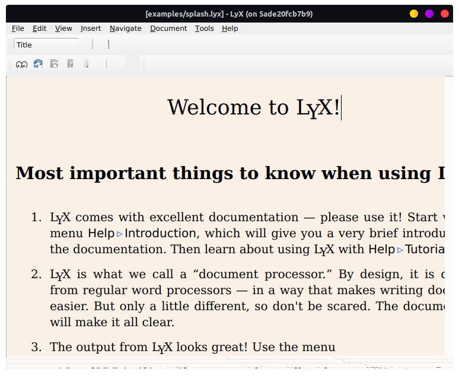

# A Dockerised LyX

This repo contains a containerized version of [LyX](https://www.lyx.org/), the LaTeX WYSIWYG editor, built on [Ubuntu 23.04](https://hub.docker.com/_/ubuntu/tags?page=1&name=23.04). Ideal for running on systems with incompatible or older dependencies.

## Why Containerize LyX?
On January 7, 2023, LyX 2.3.7 was released. This version [isn't available on](http://ppa.launchpad.net/lyx-devel/release/ubuntu/dists/) for Ubuntu 20.04 users via the lyx-devel PPA, which has been discontinued after nearly a decade. However, new versions of LyX are [available](https://launchpad.net/ubuntu/+source/lyx) in universe repo of Ubuntu.

## Why not flatpak, snap or appimage?
I'm lazy. Simple as that.  &#58;&#124;

## Supported LyX Version
Currently, I am able to build LyX 2.3.7. However, there are some issues with the container.

* LyX 2.3.6.1 on Ubuntu 22.04 just works fine. However, there are some problems with LyX 2.3.7 on Ubuntu 23.04. This is probably due to the choice of a non-LTS version.
* pdflatex not working.
* need to find more issues.

## Extending the features
At some point I need to include these dependencies.

* chktex: check for typographical errors
* gnuhtml2latex: import HTML documents
* groff: improved table formatting in plain text exports
* librsvg2-bin, inkscape: use the SVG image format in LyX documents
* linuxdoc-tools: export SGML LinuxDoc documents
* mythes-*: use the OpenOffice.org/LibreOffice Thesaurus
* noweb: import noweb files
* rcs: integrated version control
* sgmltools-lite: export SGML DocBook documents
* texlive-xetex: use the XeTeX typesetting system
* wv: import MS Word documents

## Building the container
Currently, the docker build are not automated with github-actions. One can build the container with the following command:

```sh
docker build -t lyx-container .
```

This will add the docker container to `docker images`.
```sh
╰─ docker images                                                             ─╯
REPOSITORY            TAG           IMAGE ID       CREATED         SIZE
lyx-container         latest        c510e25efddf   2 minutes ago   1.45GB
prakhars962/deepinn   pre-release   886808706155   3 months ago    6.99GB
pytorch/pytorch       latest        26551f1051e7   4 months ago    6.48GB
modulus               22.09         3043d21ce86d   12 months ago   17.2GB
```

Now we need to add docker to the access control list with the following command:
```sh
xhost +local:docker
```
* `xhost` : The command used to manage the access control list for the X server.
* `+` : Add to the list (as opposed to - which would remove from the list).
* `local:docker` : Allow local connections from Docker containers.

The docker container can be launched with the following command:
```sh
docker run -it --rm \                                                     
-e DISPLAY=$DISPLAY \
-v /tmp/.X11-unix:/tmp/.X11-unix \
lyx-container
```
* `-e DISPLAY=$DISPLAY` : Sets the DISPLAY environment variable inside the container.
* `-v /tmp/.X11-unix:/tmp/.X11-unix` : Mounts the X11 UNIX socket into the container, 

And you should be able to see this screen. Bit glitchy atm.



## For tinkering

One can easily tinker the container within an interactive session.

```sh
docker run -it --rm lyx-container /bin/bash
```

* `-it`: The flags to run the container in interactive mode with a terminal.
* `--rm`: Automatically remove the container when it exits.
* `/bin/bash`: The command to open a bash shell.

Here is a simple example to check the version of LyX available on Ubuntu 23.04.

```sh
╰─ docker run -it --rm lyx-container /bin/bash                               ─╯

root@cac097c14f8e:/# apt-c
apt-cache   apt-cdrom   apt-config  
root@cac097c14f8e:/# apt-cache policy lyx
lyx:
  Installed: 2.3.7-1
  Candidate: 2.3.7-1
  Version table:
 *** 2.3.7-1 100
        100 /var/lib/dpkg/status
root@cac097c14f8e:/# 
```

## License

This project is licensed under AGPL-3.0. See the [LICENSE](LICENSE) file for details.
